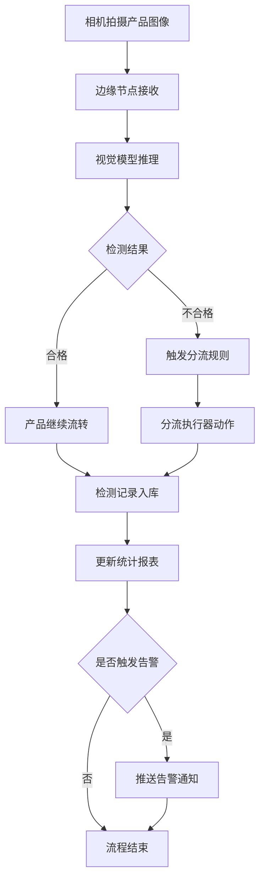

## 1. 产品概述

工业AI视觉质检闭环系统是一套面向制造业的智能质检解决方案，对接机器视觉相机，实现产品缺陷实时检测、不合格品自动分流与质检报表自动生成，攻克视觉模型边缘部署与高速流水线同步难题。

- 目标用户：制造业产线质检人员、生产管理者、质量工程师
- 核心价值：替代人工目检，提升检测精度与效率，实现质检全流程数字化闭环

## 2. 核心功能

### 2.1 用户角色

| 角色 | 注册方式 | 核心权限 |
|------|----------|----------|
| 质检操作员 | 管理员分配账号 | 查看实时检测数据、操作分流设备、查看报表 |
| 生产管理员 | 管理员分配账号 | 管理产线配置、查看统计报表、管理相机与模型 |
| 系统管理员 | 系统初始化 | 全部权限，包括用户管理、系统配置 |

### 2.2 功能模块

1. **实时监控仪表盘**：产线运行状态、检测实时数据流、缺陷告警
2. **缺陷检测管理**：缺陷类型配置、检测记录查询、缺陷图像查看
3. **自动分流控制**：分流规则配置、分流设备状态、不合格品统计
4. **质检报表中心**：日报/周报/月报生成、导出、趋势分析
5. **设备与模型管理**：相机接入管理、视觉模型部署、边缘节点状态
6. **系统管理**：用户管理、产线配置、系统参数

### 2.3 页面详情

| 页面名称 | 模块名称 | 功能描述 |
|----------|----------|----------|
| 实时监控仪表盘 | 产线状态卡片 | 展示各产线运行状态（运行中/停止/故障）、检测速率、合格率 |
| 实时监控仪表盘 | 实时检测流 | 实时展示最新检测产品图像与判定结果，WebSocket推送 |
| 实时监控仪表盘 | 缺陷告警面板 | 缺陷频发告警、连续不合格告警、设备异常告警 |
| 缺陷检测管理 | 缺陷类型配置 | CRUD缺陷类型（划痕、凹陷、色差、变形等），配置严重等级 |
| 缺陷检测管理 | 检测记录列表 | 分页查询检测记录，支持按时间/产品/缺陷类型筛选 |
| 缺陷检测管理 | 缺陷图像详情 | 查看缺陷产品原图与标注图，缺陷位置高亮 |
| 自动分流控制 | 分流规则配置 | 配置不同缺陷等级对应的分流动作（合格/返工/报废） |
| 自动分流控制 | 分流设备状态 | 查看分流执行器在线状态与执行日志 |
| 自动分流控制 | 不合格品统计 | 按缺陷类型/等级/时段统计不合格品数量与比例 |
| 质检报表中心 | 报表生成 | 选择时间范围与产线，生成日报/周报/月报 |
| 质检报表中心 | 趋势图表 | 合格率趋势、缺陷分布饼图、TOP缺陷排行 |
| 质检报表中心 | 报表导出 | 导出PDF/Excel格式报表 |
| 设备与模型管理 | 相机管理 | 添加/编辑/删除相机，配置拍摄参数、关联产线 |
| 设备与模型管理 | 模型部署 | 上传/切换视觉检测模型，查看模型版本与精度指标 |
| 设备与模型管理 | 边缘节点 | 查看边缘计算节点状态（CPU/内存/推理延迟） |
| 系统管理 | 用户管理 | 用户CRUD、角色分配、密码重置 |
| 系统管理 | 产线配置 | 产线CRUD、关联相机与分流设备 |
| 系统管理 | 系统参数 | 检测阈值、告警规则、数据保留策略等参数配置 |

## 3. 核心流程

### 3.1 视觉质检闭环流程

相机拍摄产品图像 → 边缘节点接收图像 → 视觉模型推理检测 → 判定合格/不合格 → 合格品继续流转/不合格品触发分流 → 分流执行器动作 → 检测记录入库 → 更新统计报表 → 告警判断与推送

### 3.2 报表生成流程

用户选择报表条件 → 系统聚合检测数据 → 生成统计图表 → 渲染报表页面 → 用户预览/导出

## 4. 用户界面设计

### 4.1 设计风格

- **主色调**：深蓝(#1B2A4A) + 工业橙(#FF6B35)作为强调色，体现工业质感
- **辅助色**：状态绿(#22C55E)表示合格/正常，警告黄(#FBBF24)，危险红(#EF4444)
- **按钮风格**：圆角4px，主按钮实心深蓝，次按钮描边
- **字体**：标题使用思源黑体(Noto Sans SC)，正文14px，数据展示使用等宽字体
- **布局风格**：左侧固定导航栏 + 顶部工具栏 + 主内容区，卡片式布局
- **图标**：使用lucide-react图标库，线性风格

### 4.2 页面设计概览

| 页面名称 | 模块名称 | UI元素 |
|----------|----------|--------|
| 实时监控仪表盘 | 产线状态卡片 | 3列网格卡片，深色背景，绿色/红色状态指示灯，数字动画计数 |
| 实时监控仪表盘 | 实时检测流 | 瀑布流布局，产品图像缩略图+判定标签，自动滚动 |
| 实时监控仪表盘 | 缺陷告警面板 | 右侧固定面板，告警条目带时间戳与严重等级色条 |
| 缺陷检测管理 | 缺陷类型配置 | 表格+抽屉编辑，颜色标签区分严重等级 |
| 缺陷检测管理 | 检测记录列表 | 数据表格，行展开查看缺陷图像，支持多条件筛选 |
| 自动分流控制 | 分流规则配置 | 可视化规则卡片，拖拽排序优先级 |
| 质检报表中心 | 趋势图表 | 折线图+柱状图+饼图组合，支持时间轴缩放 |
| 设备与模型管理 | 相机管理 | 设备卡片网格，在线/离线状态指示 |

### 4.3 响应式设计

桌面优先设计，最小支持1280px宽度。侧边栏可折叠，数据表格支持横向滚动，图表自适应容器宽度。

### 4.4 动效设计

- 页面切换：淡入淡出 200ms
- 数据刷新：数字滚动动画
- 告警出现：从右侧滑入 + 脉冲闪烁
- 卡片悬停：微微上浮 + 阴影加深
