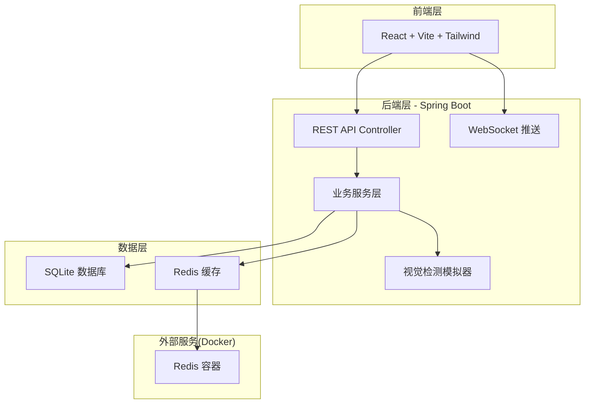
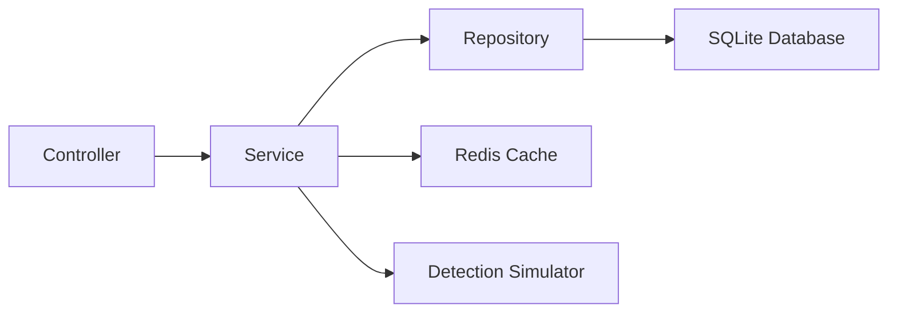
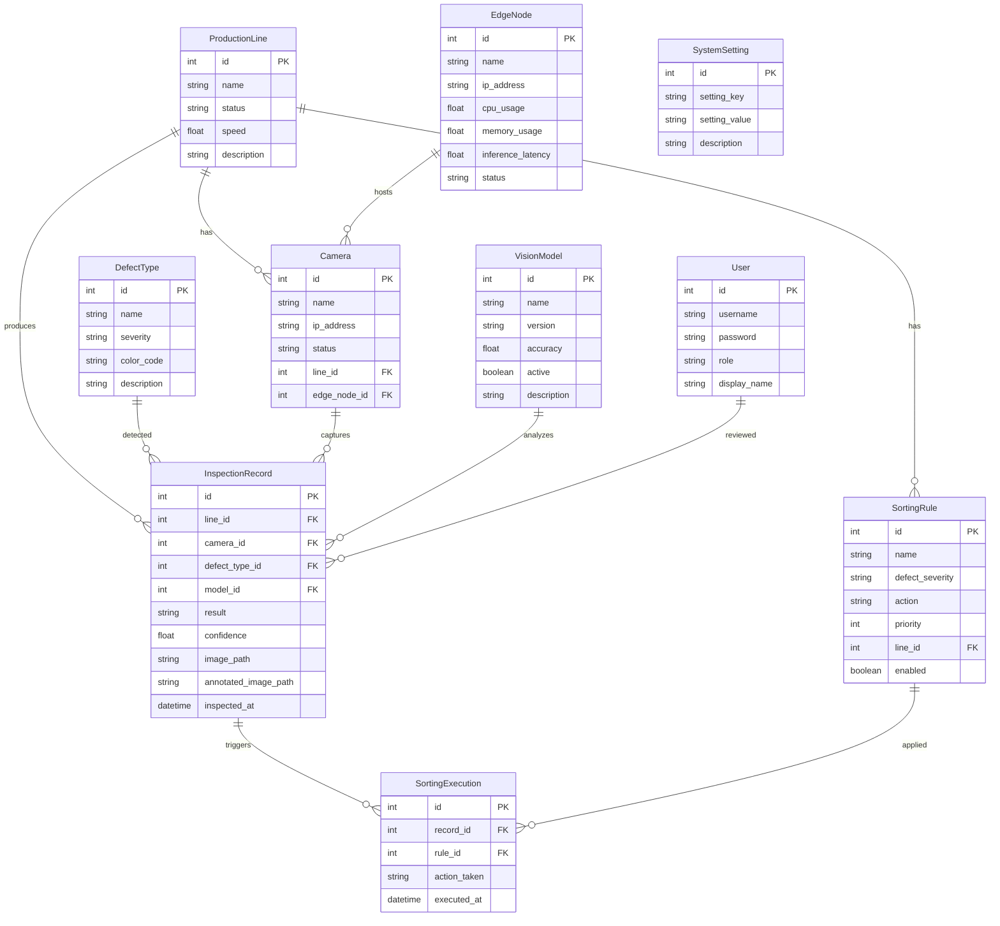

## 1. 架构设计



## 2. 技术说明

- **前端**：React@18 + TypeScript + Vite + TailwindCSS + Zustand + Recharts + lucide-react
- **初始化工具**：vite-init (react-express-ts模板，后替换为自定义Java后端)
- **后端**：Java Spring Boot 3.2 + Spring WebSocket + Spring Data JPA + SQLite JDBC
- **数据库**：SQLite（单文件嵌入式数据库，无需额外安装）
- **缓存**：Redis（Docker容器，用于实时数据缓存与WebSocket会话管理）
- **构建工具**：Maven（后端）、npm（前端）

## 3. 路由定义

| 路由 | 用途 |
|------|------|
| / | 重定向到 /dashboard |
| /dashboard | 实时监控仪表盘 |
| /defects | 缺陷检测管理 |
| /defects/types | 缺陷类型配置 |
| /defects/records | 检测记录查询 |
| /sorting | 自动分流控制 |
| /reports | 质检报表中心 |
| /devices | 设备与模型管理 |
| /devices/cameras | 相机管理 |
| /devices/models | 模型部署管理 |
| /devices/edges | 边缘节点状态 |
| /system | 系统管理 |
| /system/users | 用户管理 |
| /system/lines | 产线配置 |
| /system/settings | 系统参数 |

## 4. API定义

### 4.1 产线与状态

```
GET    /api/production-lines          # 获取产线列表
POST   /api/production-lines          # 创建产线
PUT    /api/production-lines/{id}     # 更新产线
DELETE /api/production-lines/{id}     # 删除产线
GET    /api/production-lines/{id}/status  # 获取产线实时状态
```

### 4.2 缺陷检测

```
GET    /api/defect-types              # 获取缺陷类型列表
POST   /api/defect-types              # 创建缺陷类型
PUT    /api/defect-types/{id}         # 更新缺陷类型
DELETE /api/defect-types/{id}         # 删除缺陷类型
GET    /api/inspection-records        # 获取检测记录（分页+筛选）
GET    /api/inspection-records/{id}   # 获取检测记录详情
POST   /api/inspection-records/simulate  # 触发模拟检测
```

### 4.3 分流控制

```
GET    /api/sorting-rules             # 获取分流规则列表
POST   /api/sorting-rules             # 创建分流规则
PUT    /api/sorting-rules/{id}        # 更新分流规则
DELETE /api/sorting-rules/{id}        # 删除分流规则
GET    /api/sorting-executions        # 获取分流执行日志
GET    /api/sorting/statistics        # 获取不合格品统计
```

### 4.4 报表

```
GET    /api/reports/daily             # 获取日报数据
GET    /api/reports/weekly            # 获取周报数据
GET    /api/reports/monthly           # 获取月报数据
GET    /api/reports/trends            # 获取趋势数据
GET    /api/reports/export?format=pdf|excel  # 导出报表
```

### 4.5 设备管理

```
GET    /api/cameras                   # 获取相机列表
POST   /api/cameras                   # 添加相机
PUT    /api/cameras/{id}              # 更新相机
DELETE /api/cameras/{id}              # 删除相机
GET    /api/models                    # 获取模型列表
POST   /api/models                    # 上传/注册模型
PUT    /api/models/{id}/activate      # 激活模型
GET    /api/edge-nodes                # 获取边缘节点状态
```

### 4.6 系统管理

```
GET    /api/users                     # 获取用户列表
POST   /api/users                     # 创建用户
PUT    /api/users/{id}                # 更新用户
DELETE /api/users/{id}                # 删除用户
GET    /api/system/settings           # 获取系统参数
PUT    /api/system/settings           # 更新系统参数
```

### 4.7 WebSocket

```
/ws/inspections    # 实时检测数据推送
/ws/alerts         # 告警推送
```

## 5. 服务器架构图



## 6. 数据模型

### 6.1 数据模型定义



### 6.2 数据定义语言

```sql
CREATE TABLE production_line (
    id INTEGER PRIMARY KEY AUTOINCREMENT,
    name TEXT NOT NULL,
    status TEXT NOT NULL DEFAULT 'STOPPED',
    speed REAL NOT NULL DEFAULT 0,
    description TEXT
);

CREATE TABLE camera (
    id INTEGER PRIMARY KEY AUTOINCREMENT,
    name TEXT NOT NULL,
    ip_address TEXT NOT NULL,
    status TEXT NOT NULL DEFAULT 'OFFLINE',
    line_id INTEGER REFERENCES production_line(id),
    edge_node_id INTEGER REFERENCES edge_node(id),
    resolution TEXT DEFAULT '1920x1080',
    fps INTEGER DEFAULT 30
);

CREATE TABLE edge_node (
    id INTEGER PRIMARY KEY AUTOINCREMENT,
    name TEXT NOT NULL,
    ip_address TEXT NOT NULL,
    cpu_usage REAL DEFAULT 0,
    memory_usage REAL DEFAULT 0,
    inference_latency REAL DEFAULT 0,
    status TEXT NOT NULL DEFAULT 'OFFLINE'
);

CREATE TABLE defect_type (
    id INTEGER PRIMARY KEY AUTOINCREMENT,
    name TEXT NOT NULL,
    severity TEXT NOT NULL DEFAULT 'MINOR',
    color_code TEXT DEFAULT '#FBBF24',
    description TEXT
);

CREATE TABLE vision_model (
    id INTEGER PRIMARY KEY AUTOINCREMENT,
    name TEXT NOT NULL,
    version TEXT NOT NULL,
    accuracy REAL DEFAULT 0,
    active INTEGER DEFAULT 0,
    description TEXT,
    created_at TIMESTAMP DEFAULT CURRENT_TIMESTAMP
);

CREATE TABLE inspection_record (
    id INTEGER PRIMARY KEY AUTOINCREMENT,
    line_id INTEGER REFERENCES production_line(id),
    camera_id INTEGER REFERENCES camera(id),
    defect_type_id INTEGER REFERENCES defect_type(id),
    model_id INTEGER REFERENCES vision_model(id),
    result TEXT NOT NULL DEFAULT 'PASS',
    confidence REAL DEFAULT 0,
    image_path TEXT,
    annotated_image_path TEXT,
    inspected_at TIMESTAMP DEFAULT CURRENT_TIMESTAMP
);

CREATE TABLE sorting_rule (
    id INTEGER PRIMARY KEY AUTOINCREMENT,
    name TEXT NOT NULL,
    defect_severity TEXT NOT NULL,
    action TEXT NOT NULL,
    priority INTEGER DEFAULT 0,
    line_id INTEGER REFERENCES production_line(id),
    enabled INTEGER DEFAULT 1
);

CREATE TABLE sorting_execution (
    id INTEGER PRIMARY KEY AUTOINCREMENT,
    record_id INTEGER REFERENCES inspection_record(id),
    rule_id INTEGER REFERENCES sorting_rule(id),
    action_taken TEXT NOT NULL,
    executed_at TIMESTAMP DEFAULT CURRENT_TIMESTAMP
);

CREATE TABLE user (
    id INTEGER PRIMARY KEY AUTOINCREMENT,
    username TEXT NOT NULL UNIQUE,
    password TEXT NOT NULL,
    role TEXT NOT NULL DEFAULT 'OPERATOR',
    display_name TEXT
);

CREATE TABLE system_setting (
    id INTEGER PRIMARY KEY AUTOINCREMENT,
    setting_key TEXT NOT NULL UNIQUE,
    setting_value TEXT,
    description TEXT
);
```
