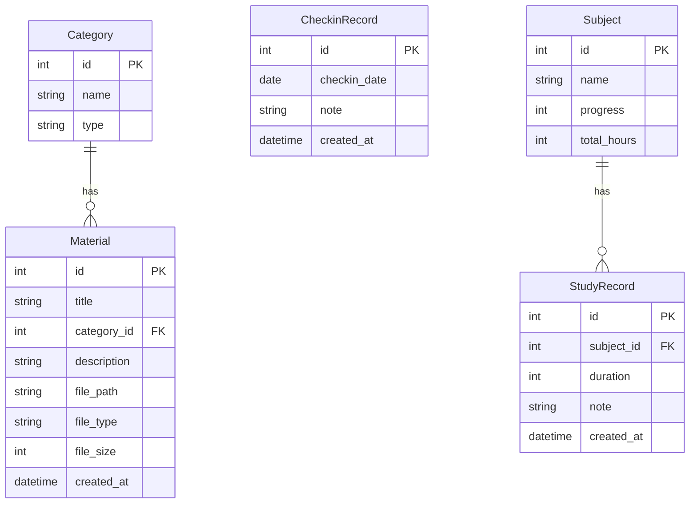

## 1. 架构设计

```mermaid
graph TB
    subgraph "前端层"
        "React + TypeScript + Vite + Tailwind CSS"
    end
    subgraph "后端层"
        "FastAPI + Uvicorn + SQLAlchemy"
    end
    subgraph "数据层"
        "SQLite 数据库"
        "文件存储(uploads目录)"
    end
    "前端层" -->|"HTTP/REST API"| "后端层"
    "后端层" -->|"SQLAlchemy ORM"| "SQLite 数据库"
    "后端层" -->|"文件读写"| "文件存储(uploads目录)"
```

## 2. 技术说明

- 前端：React@18 + TypeScript + Vite + Tailwind CSS + Zustand
- 初始化工具：vite-init
- 后端：FastAPI + Uvicorn + SQLAlchemy + Alembic
- 数据库：SQLite
- 文件存储：本地 uploads 目录
- 进程管理：Concurrently 同时启动前后端

## 3. 路由定义

| 路由 | 用途 |
|------|------|
| / | 首页仪表盘 |
| /materials | 资料中心 |
| /checkin | 打卡记录 |
| /progress | 进度追踪 |

## 4. API定义

### 4.1 资料管理

```typescript
// 获取资料分类列表
GET /api/categories
Response: { id: number; name: string; type: string; count: number }[]

// 获取资料列表（支持分页和筛选）
GET /api/materials?page=1&page_size=12&category_id=&search=
Response: { items: Material[]; total: number; page: number; page_size: number }

// 上传资料
POST /api/materials
Body: FormData { file: File; title: string; category_id: number; description: string }
Response: Material

// 下载资料
GET /api/materials/:id/download
Response: File

// 删除资料
DELETE /api/materials/:id
Response: { message: string }
```

### 4.2 打卡记录

```typescript
// 打卡
POST /api/checkin
Body: { note: string }
Response: CheckinRecord

// 获取打卡记录
GET /api/checkin?year=2026&month=5
Response: CheckinRecord[]

// 获取打卡统计
GET /api/checkin/stats
Response: { total_days: number; streak_days: number; month_rate: number }
```

### 4.3 学习进度

```typescript
// 获取科目列表及进度
GET /api/subjects
Response: Subject[]

// 更新科目进度
PUT /api/subjects/:id/progress
Body: { progress: number; note: string; study_hours: number }
Response: Subject

// 添加学习记录
POST /api/study-records
Body: { subject_id: number; duration: number; note: string }
Response: StudyRecord

// 获取学习记录
GET /api/study-records?days=7
Response: StudyRecord[]

// 获取学习时长统计
GET /api/study-stats?days=7
Response: { date: string; hours: number }[]
```

### 4.4 仪表盘

```typescript
// 获取仪表盘概览
GET /api/dashboard
Response: {
  total_materials: number;
  total_subjects: number;
  streak_days: number;
  total_hours: number;
  today_checked_in: boolean;
  recent_materials: Material[];
  subjects_progress: { name: string; progress: number }[];
}
```

## 5. 服务端架构图

```mermaid
graph LR
    "Router" --> "Service"
    "Service" --> "Repository"
    "Repository" --> "SQLite"
```

## 6. 数据模型

### 6.1 数据模型定义



### 6.2 数据定义语言

```sql
CREATE TABLE categories (
    id INTEGER PRIMARY KEY AUTOINCREMENT,
    name VARCHAR(100) NOT NULL,
    type VARCHAR(50) NOT NULL
);

CREATE TABLE materials (
    id INTEGER PRIMARY KEY AUTOINCREMENT,
    title VARCHAR(200) NOT NULL,
    category_id INTEGER NOT NULL REFERENCES categories(id),
    description TEXT,
    file_path VARCHAR(500) NOT NULL,
    file_type VARCHAR(50),
    file_size INTEGER DEFAULT 0,
    created_at DATETIME DEFAULT CURRENT_TIMESTAMP
);

CREATE TABLE checkin_records (
    id INTEGER PRIMARY KEY AUTOINCREMENT,
    checkin_date DATE NOT NULL UNIQUE,
    note TEXT,
    created_at DATETIME DEFAULT CURRENT_TIMESTAMP
);

CREATE TABLE subjects (
    id INTEGER PRIMARY KEY AUTOINCREMENT,
    name VARCHAR(200) NOT NULL,
    progress INTEGER DEFAULT 0,
    total_hours INTEGER DEFAULT 0
);

CREATE TABLE study_records (
    id INTEGER PRIMARY KEY AUTOINCREMENT,
    subject_id INTEGER NOT NULL REFERENCES subjects(id),
    duration INTEGER NOT NULL,
    note TEXT,
    created_at DATETIME DEFAULT CURRENT_TIMESTAMP
);

-- 初始分类数据
INSERT INTO categories (name, type) VALUES ('马克思主义基本原理', '考试科目');
INSERT INTO categories (name, '英语(二)', '考试科目');
INSERT INTO categories (name, '高等数学', '考试科目');
INSERT INTO categories (name, '中国近现代史纲要', '考试科目');
INSERT INTO categories (name, '教材', '资料类型');
INSERT INTO categories (name, '真题', '资料类型');
INSERT INTO categories (name, '笔记', '资料类型');
INSERT INTO categories (name, '视频', '资料类型');

-- 初始科目数据
INSERT INTO subjects (name, progress, total_hours) VALUES ('马克思主义基本原理', 25, 12);
INSERT INTO subjects (name, '英语(二)', 40, 20);
INSERT INTO subjects (name, '高等数学', 15, 8);
INSERT INTO subjects (name, '中国近现代史纲要', 60, 30);
```
