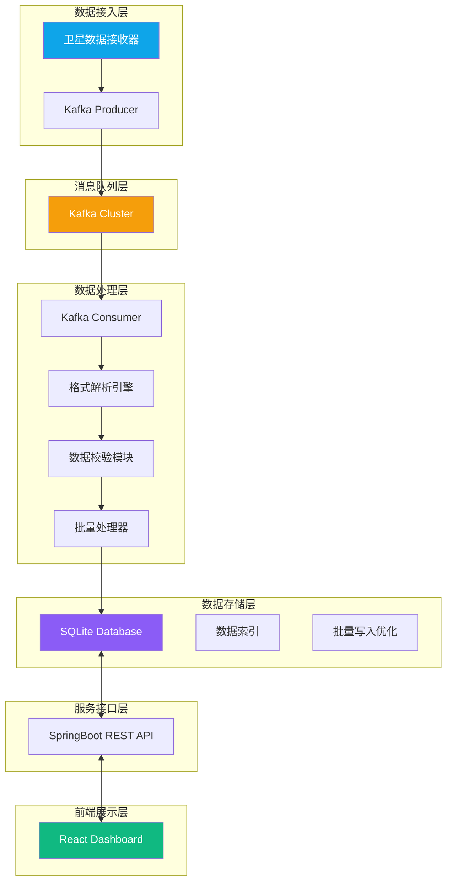
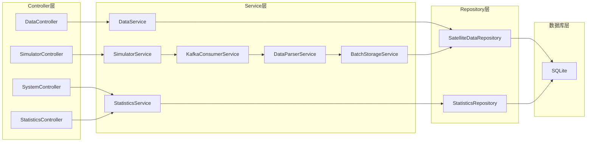
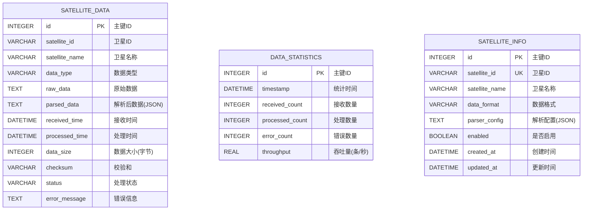

## 1. 架构设计

系统采用分层架构设计，确保高吞吐量、低延迟、数据零丢失。



## 2. 技术说明

### 2.1 后端技术栈
- **框架**：SpringBoot 3.2.x
- **消息队列**：Apache Kafka 2.8.x
- **数据库**：SQLite 3.x（通过Spring Data JPA + Hibernate + SQLite Dialect）
- **连接池**：HikariCP
- **JSON处理**：Jackson
- **构建工具**：Maven
- **Java版本**：JDK 17

### 2.2 前端技术栈
- **框架**：React 18 + TypeScript
- **构建工具**：Vite 5.x
- **样式方案**：TailwindCSS 3.x
- **状态管理**：Zustand
- **路由**：React Router DOM 6.x
- **图表库**：Recharts
- **图标库**：Lucide React
- **HTTP客户端**：Axios
- **UI组件**：自定义组件 + TailwindCSS

### 2.3 部署架构
- **容器化**：Docker + Docker Compose
- **中间件**：Kafka（Docker镜像）、ZooKeeper（Docker镜像）
- **服务端口**：
  - 后端API：8080
  - 前端：3000
  - Kafka：9092
  - ZooKeeper：2181

## 3. 路由定义

| 路由路径 | 页面名称 | 功能说明 |
|---------|----------|---------|
| / | 实时监控面板 | 数据速率、系统状态、最新数据概览 |
| /data | 数据查询 | 卫星数据列表查询、筛选、详情查看 |
| /system | 系统状态 | 服务状态、资源使用率监控 |
| /satellites | 卫星管理 | 卫星信息配置（预留功能） |

## 4. API定义

### 4.1 TypeScript类型定义

```typescript
// 卫星数据实体
interface SatelliteData {
  id: number;
  satelliteId: string;
  satelliteName: string;
  dataType: string;
  rawData: string;
  parsedData: Record<string, any>;
  receivedTime: string;
  processedTime: string;
  dataSize: number;
  checksum: string;
  status: 'RECEIVED' | 'PROCESSED' | 'ERROR';
  errorMessage?: string;
}

// 系统状态
interface SystemStatus {
  kafkaStatus: 'CONNECTED' | 'DISCONNECTED';
  databaseStatus: 'CONNECTED' | 'DISCONNECTED';
  uptime: number;
  totalRecords: number;
  todayRecords: number;
  memoryUsage: number;
  cpuUsage: number;
  diskUsage: number;
}

// 数据统计
interface DataStatistics {
  timestamp: string;
  receivedCount: number;
  processedCount: number;
  errorCount: number;
  throughput: number;
}

// 分页结果
interface PageResult<T> {
  content: T[];
  totalElements: number;
  totalPages: number;
  pageNumber: number;
  pageSize: number;
}
```

### 4.2 REST API接口

| HTTP方法 | API路径 | 功能说明 | 请求参数 | 返回类型 |
|---------|---------|---------|---------|---------|
| GET | /api/data/latest | 获取最新数据 | limit: number | SatelliteData[] |
| GET | /api/data | 分页查询数据 | page, size, satelliteId, startTime, endTime, dataType | PageResult<SatelliteData> |
| GET | /api/data/{id} | 获取单条数据详情 | id: number | SatelliteData |
| GET | /api/system/status | 获取系统状态 | 无 | SystemStatus |
| GET | /api/statistics/realtime | 实时统计数据 | 无 | DataStatistics |
| GET | /api/statistics/history | 历史统计数据 | minutes: number | DataStatistics[] |
| POST | /api/simulator/start | 启动数据模拟 | 无 | {status: string} |
| POST | /api/simulator/stop | 停止数据模拟 | 无 | {status: string} |

## 5. 服务器架构图



## 6. 数据模型

### 6.1 数据模型定义（ER图）



### 6.2 数据定义语言（DDL）

```sql
-- 卫星数据表
CREATE TABLE IF NOT EXISTS satellite_data (
    id INTEGER PRIMARY KEY AUTOINCREMENT,
    satellite_id VARCHAR(64) NOT NULL,
    satellite_name VARCHAR(128) NOT NULL,
    data_type VARCHAR(64) NOT NULL,
    raw_data TEXT NOT NULL,
    parsed_data TEXT,
    received_time DATETIME NOT NULL,
    processed_time DATETIME,
    data_size INTEGER NOT NULL,
    checksum VARCHAR(64),
    status VARCHAR(32) NOT NULL DEFAULT 'RECEIVED',
    error_message TEXT
);

CREATE INDEX IF NOT EXISTS idx_satellite_data_satellite_id ON satellite_data(satellite_id);
CREATE INDEX IF NOT EXISTS idx_satellite_data_received_time ON satellite_data(received_time);
CREATE INDEX IF NOT EXISTS idx_satellite_data_status ON satellite_data(status);
CREATE INDEX IF NOT EXISTS idx_satellite_data_type ON satellite_data(data_type);

-- 数据统计表
CREATE TABLE IF NOT EXISTS data_statistics (
    id INTEGER PRIMARY KEY AUTOINCREMENT,
    timestamp DATETIME NOT NULL,
    received_count INTEGER NOT NULL DEFAULT 0,
    processed_count INTEGER NOT NULL DEFAULT 0,
    error_count INTEGER NOT NULL DEFAULT 0,
    throughput REAL NOT NULL DEFAULT 0
);

CREATE INDEX IF NOT EXISTS idx_statistics_timestamp ON data_statistics(timestamp);

-- 卫星信息表
CREATE TABLE IF NOT EXISTS satellite_info (
    id INTEGER PRIMARY KEY AUTOINCREMENT,
    satellite_id VARCHAR(64) NOT NULL UNIQUE,
    satellite_name VARCHAR(128) NOT NULL,
    data_format VARCHAR(32) NOT NULL DEFAULT 'JSON',
    parser_config TEXT,
    enabled BOOLEAN NOT NULL DEFAULT 1,
    created_at DATETIME NOT NULL DEFAULT CURRENT_TIMESTAMP,
    updated_at DATETIME NOT NULL DEFAULT CURRENT_TIMESTAMP
);

-- 初始化卫星数据
INSERT OR IGNORE INTO satellite_info (satellite_id, satellite_name, data_format, enabled) VALUES
('SAT-001', '天宫一号', 'JSON', 1),
('SAT-002', '神舟十五号', 'JSON', 1),
('SAT-003', '北斗三号G1', 'HEX', 1),
('SAT-004', '风云四号A', 'CSV', 1),
('SAT-005', '高分七号', 'JSON', 1);
```

