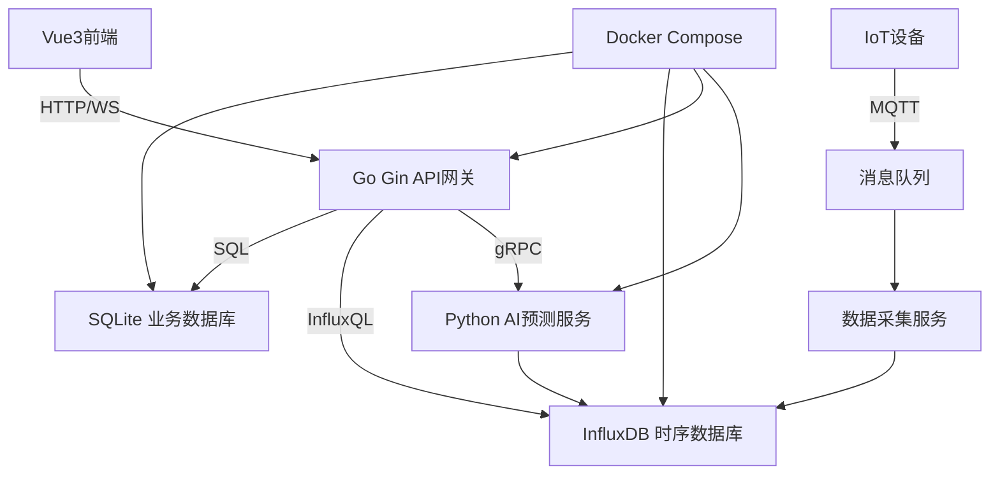
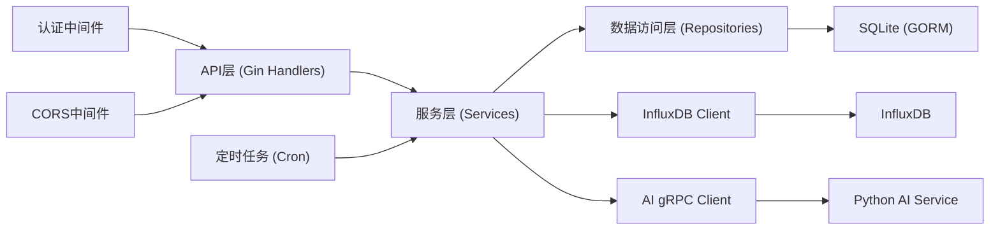
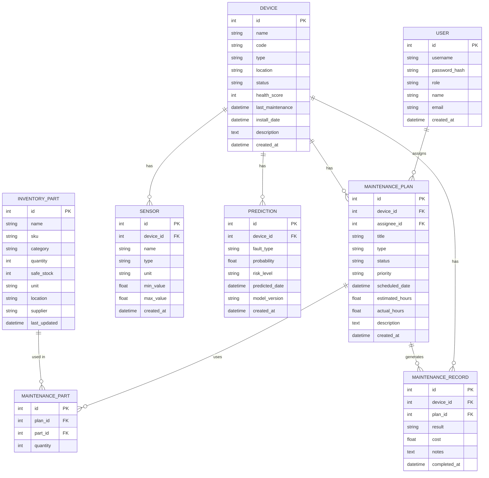

## 1. 架构设计

系统采用前后端分离架构，后端使用Go Gin提供RESTful API，前端使用Vue3构建单页应用。业务数据存储于SQLite，时序数据（传感器采集数据）存储于InfluxDB时序数据库。AI预测模型作为独立服务通过gRPC与后端通信。



## 2. 技术栈说明

### 2.1 前端技术栈
- **框架**：Vue 3.4 + TypeScript 5.3 + Vite 5.0
- **路由**：Vue Router 4.2
- **状态管理**：Pinia 2.1
- **UI组件库**：Element Plus 2.4
- **图表库**：ECharts 5.4
- **HTTP客户端**：Axios 1.6
- **样式方案**：Tailwind CSS 3.4
- **图标库**：Lucide Vue Next 0.298

### 2.2 后端技术栈
- **语言**：Go 1.21
- **Web框架**：Gin 1.9
- **ORM**：GORM 1.26 (SQLite驱动)
- **时序数据库客户端**：InfluxDB Go Client 2.12
- **认证**：JWT (golang-jwt/v5)
- **API文档**：Swagger (gin-swagger)
- **定时任务**：cron 3.0

### 2.3 AI预测服务
- **语言**：Python 3.11
- **深度学习框架**：PyTorch 2.1
- **时序模型**：LSTM 循环神经网络
- **数据处理**：NumPy 1.26, Pandas 2.1
- **gRPC服务**：gRPC Python 1.59

### 2.4 中间件（Docker部署）
- **时序数据库**：InfluxDB 2.7
- **消息队列**：MQTT Broker (Eclipse Mosquitto 2.0)

## 3. 目录结构

```
Project48/
├── backend/                    # Go后端服务
│   ├── cmd/                    # 应用入口
│   │   └── main.go
│   ├── internal/
│   │   ├── api/                # API路由与处理器
│   │   │   ├── router.go
│   │   │   ├── device.go
│   │   │   ├── prediction.go
│   │   │   ├── maintenance.go
│   │   │   ├── inventory.go
│   │   │   └── timeseries.go
│   │   ├── service/            # 业务逻辑层
│   │   │   ├── device_service.go
│   │   │   ├── prediction_service.go
│   │   │   ├── maintenance_service.go
│   │   │   └── inventory_service.go
│   │   ├── repository/         # 数据访问层
│   │   │   ├── device_repo.go
│   │   │   ├── prediction_repo.go
│   │   │   ├── maintenance_repo.go
│   │   │   └── inventory_repo.go
│   │   ├── model/              # 数据模型
│   │   │   ├── device.go
│   │   │   ├── prediction.go
│   │   │   ├── maintenance.go
│   │   │   └── inventory.go
│   │   ├── middleware/         # 中间件
│   │   │   ├── auth.go
│   │   │   └── cors.go
│   │   ├── config/             # 配置
│   │   │   └── config.go
│   │   └── pkg/                # 公共工具
│   │       ├── database/
│   │       └── influxdb/
│   ├── migrations/             # 数据库迁移
│   └── go.mod
├── frontend/                   # Vue3前端应用
│   ├── src/
│   │   ├── api/                # API接口
│   │   ├── assets/             # 静态资源
│   │   ├── components/         # 公共组件
│   │   ├── composables/        # 组合式函数
│   │   ├── layouts/            # 布局组件
│   │   ├── router/             # 路由配置
│   │   ├── stores/             # Pinia状态
│   │   ├── styles/             # 全局样式
│   │   ├── types/              # TypeScript类型
│   │   ├── utils/              # 工具函数
│   │   ├── views/              # 页面组件
│   │   ├── App.vue
│   │   └── main.ts
│   ├── public/
│   ├── index.html
│   ├── package.json
│   ├── vite.config.ts
│   ├── tailwind.config.js
│   └── tsconfig.json
├── ai-service/                 # Python AI预测服务
│   ├── src/
│   │   ├── model/              # LSTM模型定义
│   │   ├── service/            # 预测服务逻辑
│   │   ├── proto/              # gRPC协议定义
│   │   └── utils/              # 数据预处理
│   ├── data/                   # 训练数据与模型文件
│   ├── requirements.txt
│   └── main.py
├── docker/                     # Docker配置
│   ├── docker-compose.yml
│   ├── backend.Dockerfile
│   ├── frontend.Dockerfile
│   └── ai-service.Dockerfile
├── scripts/                    # 脚本目录
│   ├── init-data.go            # 数据初始化脚本
│   └── simulate-iot.go         # IoT数据模拟脚本
├── start.bat                   # Windows启动脚本
└── start.sh                    # Linux启动脚本
```

## 4. 路由定义

| 路由路径 | 页面名称 | 功能说明 |
|----------|----------|----------|
| / | 仪表盘首页 | 设备概览、健康度趋势、故障预警、维护任务统计 |
| /devices | 设备列表 | 设备管理、状态查看、搜索筛选 |
| /devices/:id | 设备详情 | 设备信息、实时数据、历史记录 |
| /prediction | 故障预测 | AI预测结果、故障风险分析 |
| /maintenance | 维护计划 | 计划日历、任务管理、维护记录 |
| /inventory | 备件库存 | 库存管理、预警列表、出入库记录 |
| /analytics | 数据分析 | 趋势分析、统计报表 |
| /login | 登录页 | 用户登录认证 |

## 5. API定义

### 5.1 认证接口
```typescript
// POST /api/auth/login
interface LoginRequest {
  username: string;
  password: string;
}

interface LoginResponse {
  token: string;
  user: {
    id: number;
    username: string;
    role: string;
    name: string;
  };
}
```

### 5.2 设备管理接口
```typescript
// GET /api/devices
interface DeviceListResponse {
  total: number;
  items: Device[];
}

interface Device {
  id: number;
  name: string;
  code: string;
  type: string;
  location: string;
  status: 'online' | 'offline' | 'warning' | 'error';
  healthScore: number;
  lastMaintenance: string;
  installDate: string;
  description: string;
  sensors: Sensor[];
}

interface Sensor {
  id: number;
  name: string;
  type: string;
  unit: string;
  minValue: number;
  maxValue: number;
  currentValue: number;
}

// GET /api/devices/:id/realtime
interface RealtimeDataResponse {
  timestamp: string;
  data: Record<string, number>;
}

// GET /api/devices/:id/history
interface HistoryDataResponse {
  timestamps: string[];
  data: Record<string, number[]>;
}
```

### 5.3 故障预测接口
```typescript
// GET /api/predictions
interface PredictionListResponse {
  items: Prediction[];
}

interface Prediction {
  id: number;
  deviceId: number;
  deviceName: string;
  faultType: string;
  probability: number;
  riskLevel: 'low' | 'medium' | 'high' | 'critical';
  predictedDate: string;
  createdAt: string;
  modelVersion: string;
}

// GET /api/predictions/model-info
interface ModelInfoResponse {
  name: string;
  version: string;
  accuracy: number;
  trainingSamples: number;
  lastTraining: string;
  parameters: {
    lstmLayers: number;
    hiddenSize: number;
    sequenceLength: number;
  };
}
```

### 5.4 维护计划接口
```typescript
// GET /api/maintenance/plans
interface MaintenancePlanResponse {
  items: MaintenancePlan[];
}

interface MaintenancePlan {
  id: number;
  deviceId: number;
  deviceName: string;
  title: string;
  type: 'preventive' | 'corrective' | 'predictive';
  status: 'pending' | 'approved' | 'in_progress' | 'completed' | 'cancelled';
  priority: 'low' | 'medium' | 'high';
  scheduledDate: string;
  estimatedHours: number;
  assignee: string;
  parts: MaintenancePart[];
  description: string;
}

interface MaintenancePart {
  partId: number;
  partName: string;
  quantity: number;
}

// POST /api/maintenance/plans/:id/execute
interface ExecutePlanRequest {
  actualHours: number;
  notes: string;
  partsUsed: MaintenancePart[];
}
```

### 5.5 备件库存接口
```typescript
// GET /api/inventory/parts
interface InventoryPartResponse {
  items: InventoryPart[];
}

interface InventoryPart {
  id: number;
  name: string;
  sku: string;
  category: string;
  quantity: number;
  safeStock: number;
  unit: string;
  location: string;
  supplier: string;
  lastUpdated: string;
}

// GET /api/inventory/alerts
interface InventoryAlertResponse {
  items: InventoryAlert[];
}

interface InventoryAlert {
  id: number;
  partId: number;
  partName: string;
  currentQuantity: number;
  safeStock: number;
  shortage: number;
  level: 'warning' | 'critical';
}
```

### 5.6 时序数据接口
```typescript
// WebSocket /ws/timeseries/:deviceId
interface TimeSeriesMessage {
  timestamp: string;
  values: Record<string, number>;
}
```

## 6. 后端服务架构



### 6.1 核心模块说明

- **DeviceService**：设备CRUD、状态管理、健康度计算
- **PredictionService**：调用AI模型、预测结果存储、预警判定
- **MaintenanceService**：自动生成维护计划、任务调度、记录管理
- **InventoryService**：库存管理、预警检测、出入库操作
- **TimeSeriesService**：时序数据写入查询、实时数据推送

## 7. 数据模型

### 7.1 ER图



### 7.2 DDL语句

```sql
-- 用户表
CREATE TABLE users (
    id INTEGER PRIMARY KEY AUTOINCREMENT,
    username VARCHAR(50) UNIQUE NOT NULL,
    password_hash VARCHAR(255) NOT NULL,
    role VARCHAR(20) NOT NULL DEFAULT 'engineer',
    name VARCHAR(100) NOT NULL,
    email VARCHAR(100),
    created_at DATETIME DEFAULT CURRENT_TIMESTAMP
);

-- 设备表
CREATE TABLE devices (
    id INTEGER PRIMARY KEY AUTOINCREMENT,
    name VARCHAR(100) NOT NULL,
    code VARCHAR(50) UNIQUE NOT NULL,
    type VARCHAR(50) NOT NULL,
    location VARCHAR(100) NOT NULL,
    status VARCHAR(20) NOT NULL DEFAULT 'online',
    health_score INTEGER NOT NULL DEFAULT 100,
    last_maintenance DATETIME,
    install_date DATETIME NOT NULL,
    description TEXT,
    created_at DATETIME DEFAULT CURRENT_TIMESTAMP
);

-- 传感器表
CREATE TABLE sensors (
    id INTEGER PRIMARY KEY AUTOINCREMENT,
    device_id INTEGER NOT NULL,
    name VARCHAR(50) NOT NULL,
    type VARCHAR(50) NOT NULL,
    unit VARCHAR(20) NOT NULL,
    min_value FLOAT NOT NULL,
    max_value FLOAT NOT NULL,
    created_at DATETIME DEFAULT CURRENT_TIMESTAMP,
    FOREIGN KEY (device_id) REFERENCES devices(id)
);

-- 预测结果表
CREATE TABLE predictions (
    id INTEGER PRIMARY KEY AUTOINCREMENT,
    device_id INTEGER NOT NULL,
    fault_type VARCHAR(50) NOT NULL,
    probability FLOAT NOT NULL,
    risk_level VARCHAR(20) NOT NULL,
    predicted_date DATETIME NOT NULL,
    model_version VARCHAR(20) NOT NULL,
    created_at DATETIME DEFAULT CURRENT_TIMESTAMP,
    FOREIGN KEY (device_id) REFERENCES devices(id)
);

-- 维护计划表
CREATE TABLE maintenance_plans (
    id INTEGER PRIMARY KEY AUTOINCREMENT,
    device_id INTEGER NOT NULL,
    assignee_id INTEGER,
    title VARCHAR(200) NOT NULL,
    type VARCHAR(20) NOT NULL,
    status VARCHAR(20) NOT NULL DEFAULT 'pending',
    priority VARCHAR(20) NOT NULL DEFAULT 'medium',
    scheduled_date DATETIME NOT NULL,
    estimated_hours FLOAT,
    actual_hours FLOAT,
    description TEXT,
    created_at DATETIME DEFAULT CURRENT_TIMESTAMP,
    FOREIGN KEY (device_id) REFERENCES devices(id),
    FOREIGN KEY (assignee_id) REFERENCES users(id)
);

-- 维护备件表
CREATE TABLE maintenance_parts (
    id INTEGER PRIMARY KEY AUTOINCREMENT,
    plan_id INTEGER NOT NULL,
    part_id INTEGER NOT NULL,
    quantity INTEGER NOT NULL,
    FOREIGN KEY (plan_id) REFERENCES maintenance_plans(id),
    FOREIGN KEY (part_id) REFERENCES inventory_parts(id)
);

-- 库存表
CREATE TABLE inventory_parts (
    id INTEGER PRIMARY KEY AUTOINCREMENT,
    name VARCHAR(100) NOT NULL,
    sku VARCHAR(50) UNIQUE NOT NULL,
    category VARCHAR(50),
    quantity INTEGER NOT NULL DEFAULT 0,
    safe_stock INTEGER NOT NULL DEFAULT 10,
    unit VARCHAR(20) NOT NULL,
    location VARCHAR(100),
    supplier VARCHAR(100),
    last_updated DATETIME DEFAULT CURRENT_TIMESTAMP
);

-- 维护记录表
CREATE TABLE maintenance_records (
    id INTEGER PRIMARY KEY AUTOINCREMENT,
    device_id INTEGER NOT NULL,
    plan_id INTEGER,
    result VARCHAR(20) NOT NULL,
    cost FLOAT,
    notes TEXT,
    completed_at DATETIME DEFAULT CURRENT_TIMESTAMP,
    FOREIGN KEY (device_id) REFERENCES devices(id),
    FOREIGN KEY (plan_id) REFERENCES maintenance_plans(id)
);

-- 索引
CREATE INDEX idx_predictions_device_id ON predictions(device_id);
CREATE INDEX idx_predictions_risk_level ON predictions(risk_level);
CREATE INDEX idx_maintenance_plans_status ON maintenance_plans(status);
CREATE INDEX idx_maintenance_plans_scheduled_date ON maintenance_plans(scheduled_date);
CREATE INDEX idx_inventory_parts_quantity ON inventory_parts(quantity);
```

### 7.3 初始化数据

```sql
-- 默认用户 (密码: admin123)
INSERT INTO users (username, password_hash, role, name, email) VALUES
('admin', '$2a$10$N9qo8uLOickgx2ZMRZoMyeIjZAgcfl7p92ldGxad68LJZdL17lhWy', 'admin', '系统管理员', 'admin@example.com'),
('engineer1', '$2a$10$N9qo8uLOickgx2ZMRZoMyeIjZAgcfl7p92ldGxad68LJZdL17lhWy', 'engineer', '张工', 'zhang@example.com'),
('manager1', '$2a$10$N9qo8uLOickgx2ZMRZoMyeIjZAgcfl7p92ldGxad68LJZdL17lhWy', 'manager', '李主管', 'li@example.com');

-- 初始设备数据
INSERT INTO devices (name, code, type, location, status, health_score, install_date, description) VALUES
('CNC数控车床-001', 'CNC-001', 'cnc', '车间A-01', 'online', 92, '2023-01-15', '高精度数控车床，用于精密零件加工'),
('工业机器人-002', 'ROB-002', 'robot', '车间A-02', 'online', 85, '2023-03-20', '六轴焊接机器人'),
('空压机-003', 'COMP-003', 'compressor', '动力房', 'online', 78, '2022-06-10', '螺杆式空气压缩机'),
('传送带-004', 'CONV-004', 'conveyor', '车间B', 'online', 95, '2023-08-01', '物料传送系统'),
('注塑机-005', 'INJ-005', 'injection', '车间C', 'warning', 65, '2022-11-30', '精密注塑成型机'),
('激光切割机-006', 'LASER-006', 'laser', '车间A-03', 'online', 88, '2023-05-12', '光纤激光切割机');

-- 传感器数据
INSERT INTO sensors (device_id, name, type, unit, min_value, max_value) VALUES
(1, '主轴温度', 'temperature', '°C', 20, 80),
(1, '振动幅度', 'vibration', 'mm/s', 0, 10),
(1, '主轴转速', 'rotation', 'rpm', 0, 5000),
(1, '负载电流', 'current', 'A', 0, 50),
(2, '关节1温度', 'temperature', '°C', 20, 70),
(2, '关节2温度', 'temperature', '°C', 20, 70),
(2, 'TCP速度', 'velocity', 'm/s', 0, 2),
(3, '排气压力', 'pressure', 'MPa', 0, 1.2),
(3, '油温', 'temperature', '°C', 20, 90),
(3, '电机电流', 'current', 'A', 0, 100),
(4, '皮带张力', 'tension', 'N', 0, 500),
(4, '电机转速', 'rotation', 'rpm', 0, 1500),
(5, '料筒温度', 'temperature', '°C', 150, 300),
(5, '注射压力', 'pressure', 'MPa', 0, 200),
(5, '锁模力', 'force', 'kN', 0, 5000),
(6, '激光器温度', 'temperature', '°C', 15, 40),
(6, '激光功率', 'power', 'W', 0, 2000),
(6, '切割头位置', 'position', 'mm', 0, 3000);

-- 库存备件数据
INSERT INTO inventory_parts (name, sku, category, quantity, safe_stock, unit, location, supplier) VALUES
('主轴轴承', 'SKF-6205', '传动部件', 15, 10, '个', 'A-01-01', 'SKF'),
('伺服电机', 'MOT-SG-100', '电气部件', 5, 8, '台', 'A-02-03', '安川'),
('液压油', 'OIL-HL-46', '润滑油', 200, 150, 'L', 'B-01-01', '壳牌'),
('空气滤芯', 'FIL-AIR-100', '过滤部件', 8, 12, '个', 'A-03-01', '曼胡默尔'),
('同步皮带', 'BELT-T5-1000', '传动部件', 12, 10, '条', 'A-01-02', '盖茨'),
('编码器', 'ENC-1024', '电气部件', 3, 5, '个', 'A-02-01', '欧姆龙'),
('PLC模块', 'PLC-S7-1200', '电气部件', 2, 3, '个', 'A-02-02', '西门子'),
('密封圈套件', 'SEAL-KIT-001', '密封部件', 25, 20, '套', 'A-04-01', 'NOK'),
('喷嘴', 'NOZ-INJ-001', '注塑部件', 6, 5, '个', 'C-01-01', '赫斯基'),
('激光保护镜', 'LENS-LASER-001', '光学部件', 4, 6, '片', 'A-05-01', 'II-VI');
```

## 8. AI预测模型设计

### 8.1 模型架构
- **模型类型**：LSTM (长短期记忆网络)
- **输入序列长度**：24小时数据（每小时采样，共24个时间步）
- **输入特征维度**：传感器指标（4-6个特征）
- **LSTM层数**：2层，隐藏单元数64
- **Dropout**：0.2 防止过拟合
- **输出**：未来24小时故障概率序列

### 8.2 训练策略
- **损失函数**：二元交叉熵
- **优化器**：Adam，学习率0.001
- **批次大小**：32
- **训练轮次**：50轮，早停策略
- **验证集比例**：20%

### 8.3 特征工程
- 数据归一化（Min-Max Scaler）
- 滑动窗口构造样本
- 提取时域特征（均值、方差、峰度、偏度）
- 异常值处理（3σ原则）
