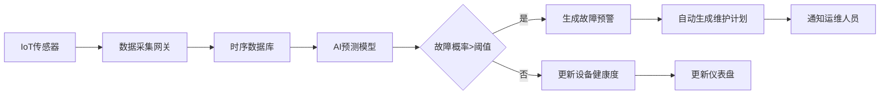

## 1. 产品概述

工业物联网设备预测性维护系统，基于Go Gin后端与Vue3前端构建，整合时序数据库与AI预测模型，实现设备故障预测、维护计划自动生成、备件库存预警三大核心功能。系统面向工业制造企业设备运维团队，解决传统事后维护导致的停机损失高、计划性差等痛点，通过AI算法提前预判设备故障，降低维护成本30%以上，提升设备综合效率(OEE)。

## 2. 核心功能

### 2.1 用户角色

| 角色 | 注册方式 | 核心权限 |
|------|----------|----------|
| 系统管理员 | 系统预置账号 | 用户管理、系统配置、数据导入导出 |
| 设备工程师 | 管理员创建 | 设备管理、数据查看、维护计划执行 |
| 运维主管 | 管理员创建 | 故障预测查看、维护计划审批、库存管理 |

### 2.2 功能模块

1. **仪表盘首页**：设备概览、健康度评分、故障预警、关键指标统计
2. **设备管理**：设备列表、设备详情、设备参数配置、实时数据监控
3. **故障预测**：AI预测结果、故障风险等级、预测准确率评估
4. **维护计划**：自动生成的维护任务、计划日历、维护记录
5. **备件库存**：库存台账、低库存预警、出入库记录
6. **数据分析**：历史趋势、故障统计、维护成本分析

### 2.3 页面详情

| 页面名称 | 模块名称 | 功能描述 |
|----------|----------|----------|
| 仪表盘首页 | 概览卡片 | 设备总数、在线设备数、健康度平均、待处理告警数 |
| 仪表盘首页 | 健康度趋势图 | 近30天设备健康度变化趋势折线图 |
| 仪表盘首页 | 故障预警列表 | 高风险设备预警，按风险等级排序 |
| 仪表盘首页 | 维护任务概览 | 今日待办、本周计划、逾期任务统计 |
| 设备管理 | 设备列表 | 分页展示设备，支持搜索、筛选、状态切换 |
| 设备管理 | 设备详情 | 设备基本信息、实时数据、历史记录、健康度分析 |
| 设备管理 | 实时监控 | 关键指标实时折线图，数据刷新间隔5秒 |
| 故障预测 | 预测列表 | 各设备故障预测结果，含故障类型、概率、预计发生时间 |
| 故障预测 | 模型详情 | AI模型参数、准确率、训练数据量 |
| 维护计划 | 计划日历 | 日历视图展示维护任务，支持拖拽调整 |
| 维护计划 | 任务详情 | 维护内容、所需备件、预计工时、负责人 |
| 备件库存 | 库存列表 | 备件库存数量、安全库存阈值、供应商信息 |
| 备件库存 | 预警列表 | 低于安全库存的备件清单，一键生成采购建议 |
| 数据分析 | 趋势分析 | 多维度数据对比，支持导出报表 |

## 3. 核心流程

### 3.1 数据采集与预测流程

IoT传感器实时采集设备运行数据（温度、振动、电流、压力等），数据写入时序数据库存储。AI预测模型定时拉取最新数据，基于LSTM时序预测算法计算设备健康度与故障概率。当预测故障概率超过阈值时，系统自动生成告警并触发维护计划生成。

### 3.2 维护计划执行流程

系统根据设备健康度、故障预测结果、维护历史自动生成维护计划。运维主管审核后分配任务，设备工程师执行维护并记录结果。维护完成后更新设备状态与备件库存，系统根据实际维护效果优化AI预测模型。

## 4. 用户界面设计

### 4.1 设计风格

- **主色调**：工业蓝 (#165DFF)，代表专业与可靠
- **辅助色**：预警橙 (#FF7D00)、危险红 (#F53F3F)、成功绿 (#00B42A)
- **中性色**：深灰 #1D2129、中灰 #4E5969、浅灰 #C9CDD4、背景 #F2F3F5
- **按钮风格**：圆角4px，简洁矩形，悬停有微妙阴影和颜色加深效果
- **字体**：中文使用 "PingFang SC"、"Microsoft YaHei"，数字使用 "Roboto Mono" 等宽字体
- **布局风格**：左侧导航栏 + 顶部工具栏 + 主内容区卡片式布局
- **图标风格**：线性图标，使用Lucide图标库，保持统一24px尺寸

### 4.2 页面设计概述

| 页面名称 | 模块名称 | UI元素 |
|----------|----------|--------|
| 仪表盘首页 | 概览卡片 | 4张统计卡片，带渐变背景和数值动画，左右布局图标与数据 |
| 仪表盘首页 | 健康度趋势图 | ECharts折线图，支持多设备对比，数据点悬停显示详情 |
| 仪表盘首页 | 预警列表 | 表格展示，行背景色随风险等级变化，右侧操作按钮 |
| 设备管理 | 设备卡片 | 网格布局卡片，展示设备状态指示灯、名称、健康度进度条 |
| 设备详情 | 实时监控 | 多个仪表盘组件，关键指标高亮显示，异常值红色闪烁 |
| 故障预测 | 预测图表 | 概率热力图，时间轴展示未来7天故障风险 |
| 维护计划 | 日历视图 | FullCalendar风格，不同任务类型用不同颜色标记 |
| 备件库存 | 库存预警 | 进度条展示库存水平，低于阈值红色高亮，补充采购按钮 |

### 4.3 响应式设计

- **桌面端优先**：设计分辨率1920x1080，支持最低1366x768
- **平板适配**：侧边栏可折叠，卡片自适应换行
- **移动端**：顶部导航下拉菜单，单列卡片布局，表格横向滚动
- **触摸优化**：按钮最小高度44px，关键操作区域增加触摸反馈

### 4.4 动效设计

- **页面加载**：骨架屏占位，内容渐入显示，延迟50ms错开
- **数据更新**：数字滚动动画，数值变化时高亮闪烁1秒
- **告警出现**：从右侧滑入，红色边框脉冲动画
- **悬停效果**：卡片上移2px，阴影加深，过渡时长200ms
- **页面切换**：淡入淡出过渡，时长300ms
