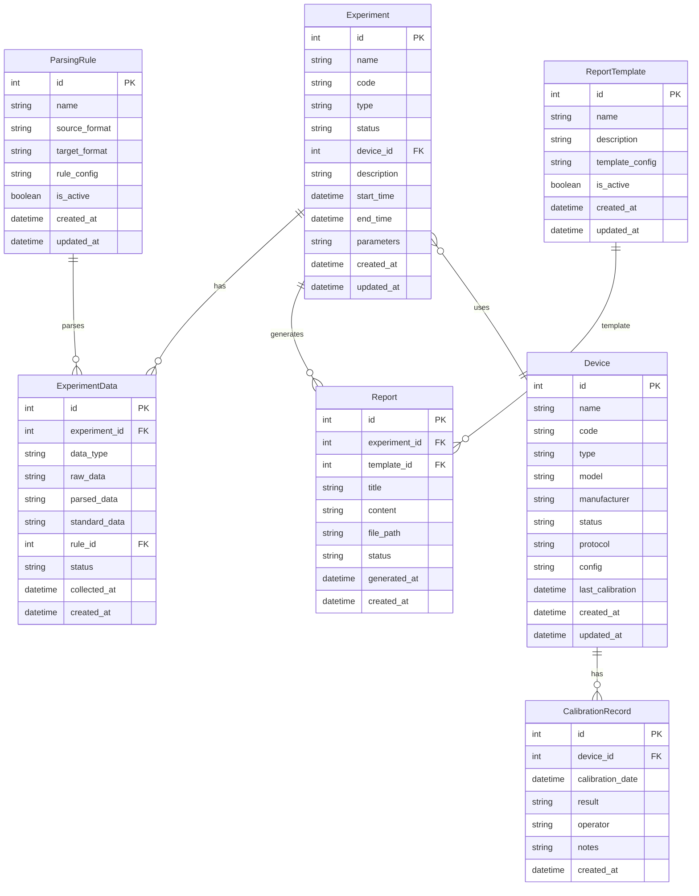

## 1. 架构设计

```mermaid
graph TB
    subgraph "前端层"
        "Vue3 App" --> "Pinia Store"
        "Vue3 App" --> "Vue Router"
        "Vue3 App" --> "Axios HTTP"
    end
    subgraph "后端层"
        "Express Server" --> "路由层"
        "路由层" --> "服务层"
        "服务层" --> "数据层"
    end
    subgraph "数据层"
        "SQLite DB" --> "试验数据表"
        "SQLite DB" --> "设备表"
        "SQLite DB" --> "报告表"
        "SQLite DB" --> "解析规则表"
    end
    subgraph "外部服务"
        "实验室设备" --> "数据采集接口"
    end
    "Axios HTTP" --> "Express Server"
```

## 2. 技术说明

- 前端: Vue3 + Vite + Pinia + Vue Router + ECharts + Element Plus
- 初始化工具: Vite
- 后端: Express4 + better-sqlite3 + multer + pdfkit
- 数据库: SQLite (better-sqlite3 驱动)
- 报告生成: PDFKit
- 数据解析: 自定义解析引擎，支持CSV/JSON/XML/二进制格式

## 3. 路由定义

| 路由 | 用途 |
|------|------|
| / | 仪表盘 |
| /experiments | 试验管理列表 |
| /experiments/create | 创建试验 |
| /experiments/:id | 试验详情 |
| /data-collection | 数据采集监控 |
| /data-collection/import | 数据导入 |
| /data-parsing | 数据解析 |
| /data-parsing/rules | 解析规则配置 |
| /reports | 报告列表 |
| /reports/generate | 生成报告 |
| /reports/:id | 报告预览 |
| /devices | 设备管理 |
| /devices/register | 设备注册 |
| /devices/:id | 设备详情 |

## 4. API定义

### 试验管理 API

| 方法 | 路径 | 描述 |
|------|------|------|
| GET | /api/experiments | 获取试验列表 |
| GET | /api/experiments/:id | 获取试验详情 |
| POST | /api/experiments | 创建试验 |
| PUT | /api/experiments/:id | 更新试验 |
| PUT | /api/experiments/:id/status | 更新试验状态 |
| DELETE | /api/experiments/:id | 删除试验 |

### 数据采集 API

| 方法 | 路径 | 描述 |
|------|------|------|
| GET | /api/data/collection | 获取采集数据列表 |
| POST | /api/data/collection/start | 启动数据采集 |
| POST | /api/data/collection/stop | 停止数据采集 |
| POST | /api/data/import | 导入数据文件 |
| GET | /api/data/validate/:experimentId | 校验试验数据 |

### 数据解析 API

| 方法 | 路径 | 描述 |
|------|------|------|
| GET | /api/parsing/rules | 获取解析规则 |
| POST | /api/parsing/rules | 创建解析规则 |
| PUT | /api/parsing/rules/:id | 更新解析规则 |
| DELETE | /api/parsing/rules/:id | 删除解析规则 |
| POST | /api/parsing/parse | 执行数据解析 |
| POST | /api/parsing/standardize | 格式标准化 |

### 报告 API

| 方法 | 路径 | 描述 |
|------|------|------|
| GET | /api/reports | 获取报告列表 |
| GET | /api/reports/:id | 获取报告详情 |
| POST | /api/reports/generate | 生成报告 |
| GET | /api/reports/:id/download | 下载报告 |
| GET | /api/reports/templates | 获取报告模板 |
| POST | /api/reports/templates | 创建报告模板 |

### 设备 API

| 方法 | 路径 | 描述 |
|------|------|------|
| GET | /api/devices | 获取设备列表 |
| GET | /api/devices/:id | 获取设备详情 |
| POST | /api/devices | 注册设备 |
| PUT | /api/devices/:id | 更新设备 |
| DELETE | /api/devices/:id | 删除设备 |
| GET | /api/devices/:id/status | 获取设备状态 |
| POST | /api/devices/:id/calibrate | 设备校准 |

### 统计 API

| 方法 | 路径 | 描述 |
|------|------|------|
| GET | /api/stats/dashboard | 仪表盘统计数据 |
| GET | /api/stats/trend | 数据趋势 |

## 5. 服务端架构图

```mermaid
graph LR
    "Controller" --> "Service"
    "Service" --> "Repository"
    "Repository" --> "SQLite"
```

## 6. 数据模型

### 6.1 数据模型定义



### 6.2 数据定义语言

```sql
CREATE TABLE devices (
    id INTEGER PRIMARY KEY AUTOINCREMENT,
    name TEXT NOT NULL,
    code TEXT NOT NULL UNIQUE,
    type TEXT NOT NULL,
    model TEXT,
    manufacturer TEXT,
    status TEXT DEFAULT 'online',
    protocol TEXT DEFAULT 'TCP',
    config TEXT DEFAULT '{}',
    last_calibration DATETIME,
    created_at DATETIME DEFAULT CURRENT_TIMESTAMP,
    updated_at DATETIME DEFAULT CURRENT_TIMESTAMP
);

CREATE TABLE experiments (
    id INTEGER PRIMARY KEY AUTOINCREMENT,
    name TEXT NOT NULL,
    code TEXT NOT NULL UNIQUE,
    type TEXT NOT NULL,
    status TEXT DEFAULT 'draft',
    device_id INTEGER REFERENCES devices(id),
    description TEXT,
    start_time DATETIME,
    end_time DATETIME,
    parameters TEXT DEFAULT '{}',
    created_at DATETIME DEFAULT CURRENT_TIMESTAMP,
    updated_at DATETIME DEFAULT CURRENT_TIMESTAMP
);

CREATE TABLE experiment_data (
    id INTEGER PRIMARY KEY AUTOINCREMENT,
    experiment_id INTEGER REFERENCES experiments(id),
    data_type TEXT NOT NULL,
    raw_data TEXT,
    parsed_data TEXT,
    standard_data TEXT,
    rule_id INTEGER REFERENCES parsing_rules(id),
    status TEXT DEFAULT 'raw',
    collected_at DATETIME DEFAULT CURRENT_TIMESTAMP,
    created_at DATETIME DEFAULT CURRENT_TIMESTAMP
);

CREATE TABLE calibration_records (
    id INTEGER PRIMARY KEY AUTOINCREMENT,
    device_id INTEGER REFERENCES devices(id),
    calibration_date DATETIME NOT NULL,
    result TEXT NOT NULL,
    operator TEXT,
    notes TEXT,
    created_at DATETIME DEFAULT CURRENT_TIMESTAMP
);

CREATE TABLE parsing_rules (
    id INTEGER PRIMARY KEY AUTOINCREMENT,
    name TEXT NOT NULL,
    source_format TEXT NOT NULL,
    target_format TEXT NOT NULL DEFAULT 'JSON',
    rule_config TEXT NOT NULL DEFAULT '{}',
    is_active INTEGER DEFAULT 1,
    created_at DATETIME DEFAULT CURRENT_TIMESTAMP,
    updated_at DATETIME DEFAULT CURRENT_TIMESTAMP
);

CREATE TABLE reports (
    id INTEGER PRIMARY KEY AUTOINCREMENT,
    experiment_id INTEGER REFERENCES experiments(id),
    template_id INTEGER REFERENCES report_templates(id),
    title TEXT NOT NULL,
    content TEXT,
    file_path TEXT,
    status TEXT DEFAULT 'generating',
    generated_at DATETIME,
    created_at DATETIME DEFAULT CURRENT_TIMESTAMP
);

CREATE TABLE report_templates (
    id INTEGER PRIMARY KEY AUTOINCREMENT,
    name TEXT NOT NULL,
    description TEXT,
    template_config TEXT NOT NULL DEFAULT '{}',
    is_active INTEGER DEFAULT 1,
    created_at DATETIME DEFAULT CURRENT_TIMESTAMP,
    updated_at DATETIME DEFAULT CURRENT_TIMESTAMP
);

CREATE INDEX idx_experiments_status ON experiments(status);
CREATE INDEX idx_experiments_device ON experiments(device_id);
CREATE INDEX idx_experiment_data_exp ON experiment_data(experiment_id);
CREATE INDEX idx_experiment_data_status ON experiment_data(status);
CREATE INDEX idx_reports_experiment ON reports(experiment_id);
CREATE INDEX idx_devices_status ON devices(status);
```
