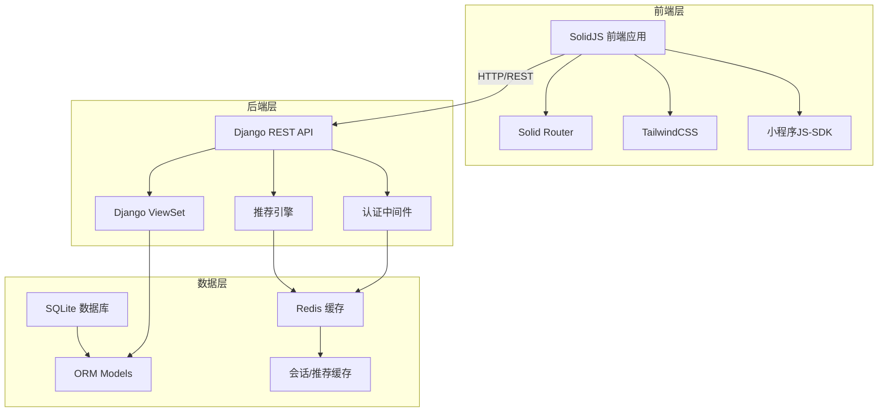
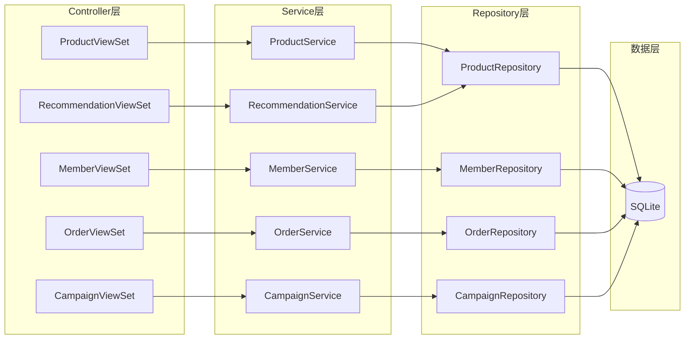
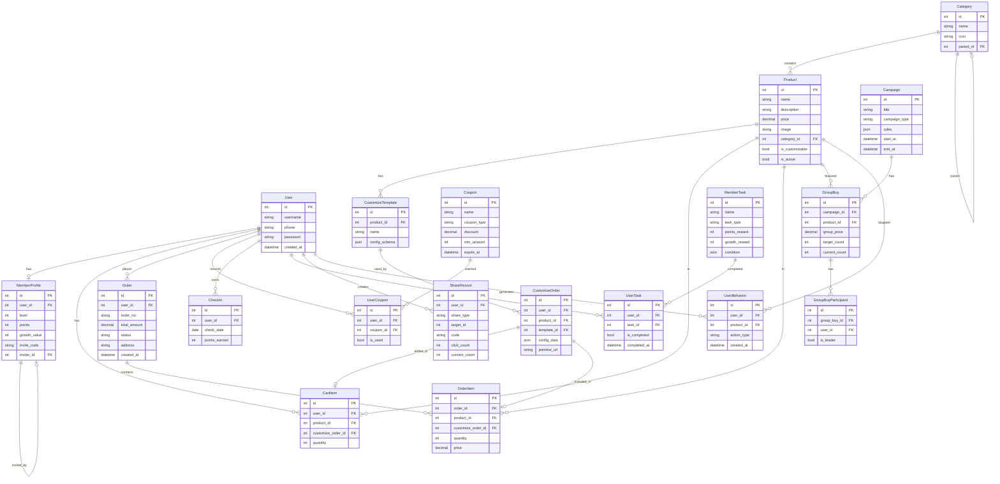

## 1. 架构设计

## 2. 技术说明
- 前端：SolidJS + Solid Router + TailwindCSS + Vite
- 后端：Django 5.x + Django REST Framework + SQLite
- 缓存：Redis（Docker镜像，用于会话缓存和推荐结果缓存）
- 数据库：SQLite（文件型数据库，零配置）
- 认证：JWT Token（SimpleJWT）
- 推荐算法：基于用户行为的协同过滤 + 内容推荐混合策略

## 3. 路由定义
| 路由 | 用途 |
|------|------|
| / | 首页，推荐商品与活动展示 |
| /products | 文创品商城，分类浏览 |
| /products/:id | 商品详情页 |
| /customize/:id | 文创品定制页 |
| /customize/:id/preview | 定制预览确认 |
| /member | 会员中心 |
| /member/points | 积分商城 |
| /member/tasks | 专属任务 |
| /campaigns | 私域活动列表 |
| /campaigns/group-buy | 拼团活动 |
| /campaigns/share | 裂变分享 |
| /cart | 购物车 |
| /orders | 订单列表 |
| /orders/:id | 订单详情 |
| /admin | 管理后台 |
| /login | 登录页 |
| /register | 注册页 |

## 4. API定义

### 4.1 认证API
| 接口 | 方法 | 说明 |
|------|------|------|
| /api/auth/register/ | POST | 用户注册 |
| /api/auth/login/ | POST | 用户登录，返回JWT |
| /api/auth/refresh/ | POST | 刷新Token |
| /api/auth/profile/ | GET | 获取用户信息 |

### 4.2 商品API
| 接口 | 方法 | 说明 |
|------|------|------|
| /api/products/ | GET | 商品列表，支持分页、筛选 |
| /api/products/:id/ | GET | 商品详情 |
| /api/products/:id/customize/ | GET | 获取定制模板和参数 |
| /api/categories/ | GET | 商品分类列表 |

### 4.3 定制API
| 接口 | 方法 | 说明 |
|------|------|------|
| /api/customize/preview/ | POST | 提交定制参数，返回预览 |
| /api/customize/submit/ | POST | 提交定制订单 |

### 4.4 会员API
| 接口 | 方法 | 说明 |
|------|------|------|
| /api/member/profile/ | GET | 会员信息（等级/积分/权益） |
| /api/member/checkin/ | POST | 每日签到 |
| /api/member/tasks/ | GET | 任务列表 |
| /api/member/tasks/:id/complete/ | POST | 完成任务 |
| /api/member/points/exchange/ | POST | 积分兑换 |

### 4.5 私域运营API
| 接口 | 方法 | 说明 |
|------|------|------|
| /api/campaigns/ | GET | 活动列表 |
| /api/coupons/ | GET | 可领取优惠券 |
| /api/coupons/:id/claim/ | POST | 领取优惠券 |
| /api/group-buy/ | GET | 拼团活动列表 |
| /api/group-buy/:id/join/ | POST | 参与拼团 |
| /api/share/generate/ | POST | 生成分享海报 |
| /api/share/track/ | POST | 分享追踪 |

### 4.6 推荐API
| 接口 | 方法 | 说明 |
|------|------|------|
| /api/recommendations/ | GET | 个性化推荐商品 |
| /api/recommendations/similar/:id/ | GET | 相似商品推荐 |

### 4.7 订单API
| 接口 | 方法 | 说明 |
|------|------|------|
| /api/cart/ | GET/POST | 购物车操作 |
| /api/cart/:id/ | PUT/DELETE | 购物车项操作 |
| /api/orders/ | GET/POST | 订单列表/创建 |
| /api/orders/:id/ | GET | 订单详情 |

### 4.8 管理后台API
| 接口 | 方法 | 说明 |
|------|------|------|
| /api/admin/dashboard/ | GET | 数据看板 |
| /api/admin/products/ | CRUD | 商品管理 |
| /api/admin/members/ | GET | 会员分析 |
| /api/admin/orders/ | GET | 订单管理 |

## 5. 服务架构图

## 6. 数据模型

### 6.1 数据模型定义

### 6.2 数据定义语言（Django ORM自动生成，此处为逻辑参考）

所有表通过Django ORM的makemigrations/migrate自动创建，无需手写DDL。初始数据通过Django management command和fixtures自动加载，包含：
- 预设商品分类（刺绣、陶瓷、剪纸、漆器、织锦等）
- 示例商品数据（各分类3-5件）
- 定制模板配置
- 优惠券模板
- 会员任务配置
- 示例活动数据
- 管理员账号（admin/admin123）
